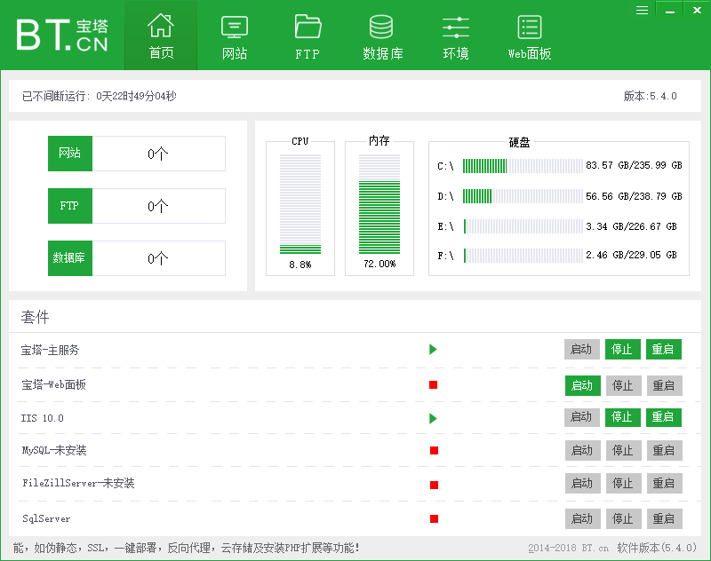
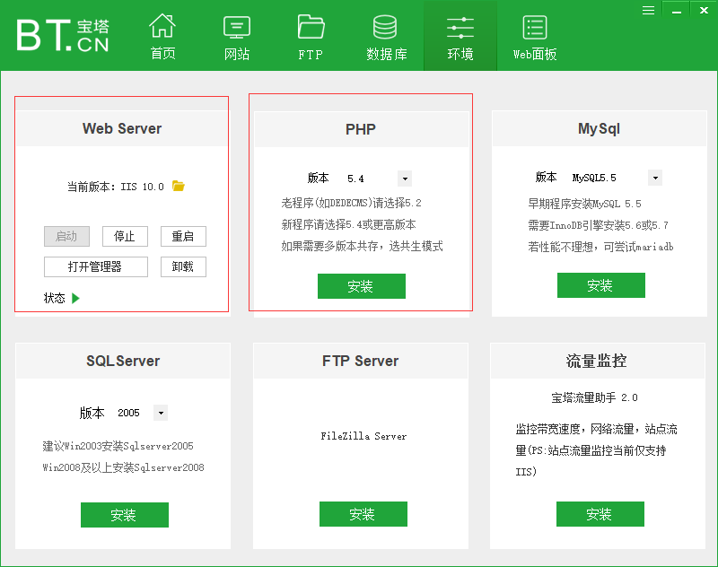
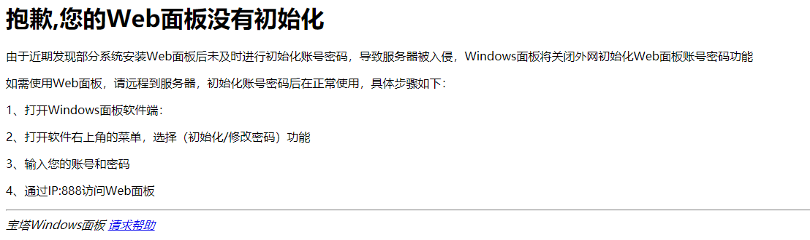
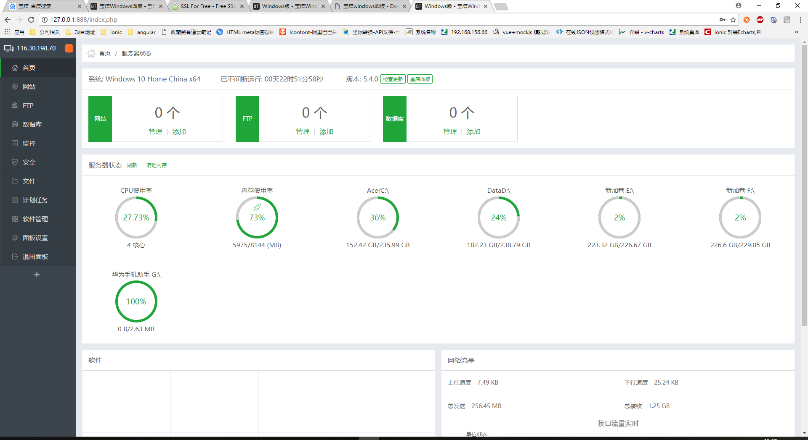
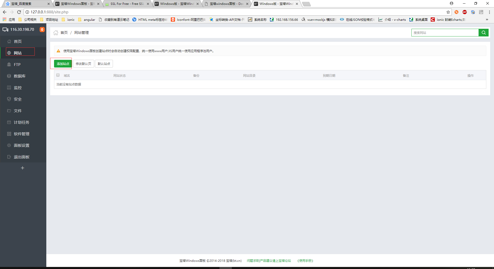
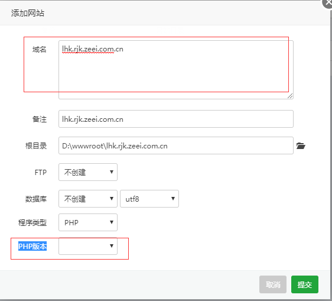
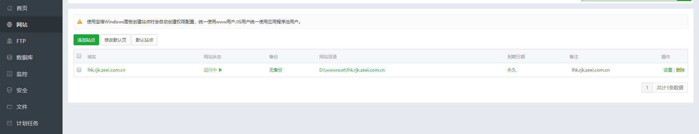
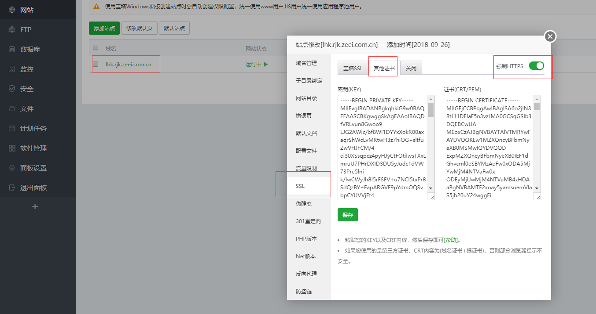
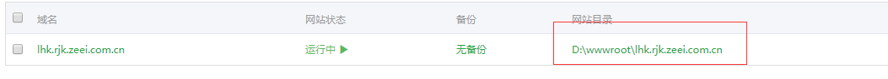
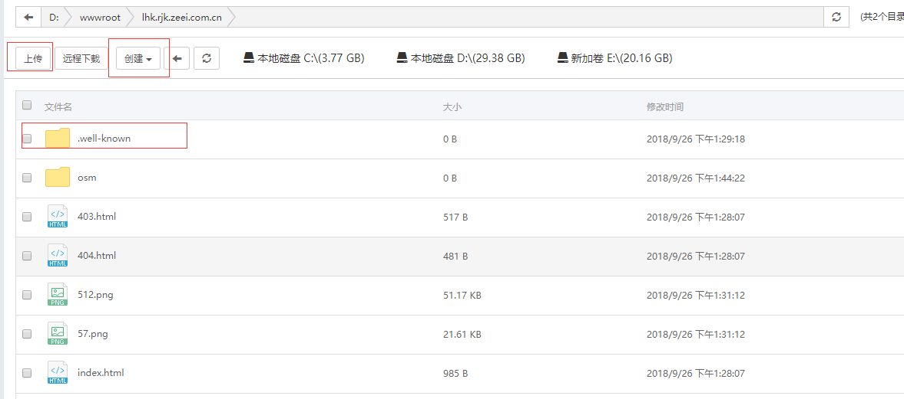

# 宝塔windows面板
### https://www.bt.cn/download/windows.html  
```
一键管理服务器，节省85%的运维时间
```
- 安装软件，运行  
  
 

- 点击环境，安装所需环境  

  

- 点击web面板，会打开浏览器进入web端管理界面    

!> `第一次使用会提示如下错误`  

  

- 配置好后重新进入，登录  

  

- 主界面  

  

- 添加站点(网站)  

  

- 输入域名  选择类型为PHP的话，如果没有安装PHP环境，PHP版本处无法选择  

 

- 网站创建完成 

 
 
- 点击域名栏，进入网站配置栏，配置SSL 

!> 启动https的话，需要填写完证书和秘钥好，保存，再开启`强制HTTPS`，开启完成后最好重启浏览器后尝试是否成功

  

- 点击`网站目录`进入目录  

  

- 网站目录里面 `.well-known`文件夹为证书所放位置，其余文件为个人网站所需，可通过上面的上传按钮进行上传，或者直接到文件夹内进行拷贝，创建按钮可创建文件夹和文件

  