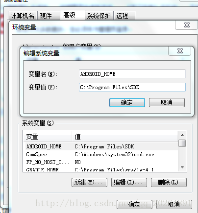
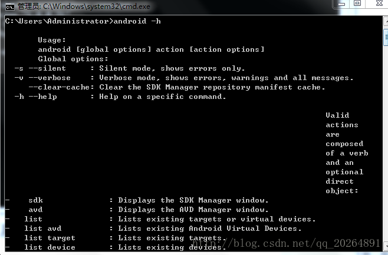
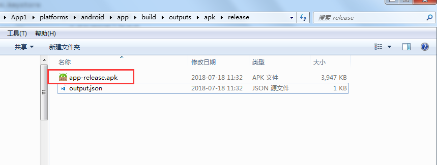

# Android 构建

# 环境配置

## JDK 安装，版本 1.8 或以上

不会配置的，参考该文[JDK 下载安装以及环境变量配置图文详解](https://blog.csdn.net/u012187452/article/details/72595040)

# Android-SDK 安装 (需要配置环境变量)

软件下载可以进入[FTP 服务器下载](ftp://192.168.100.238/%BF%AA%B7%A2%B5%F7%CA%D4%B9%A4%BE%DF/%B0%B2%D7%BF%BB%B7%BE%B3%B0%B2%D7%B0%CE%C4%BC%FE/android-sdk.zip),下载完成后，解压到一个目录。

配置环境变量，我的电脑——右键属性——-高级系统设置——-环境变量。

在下面的系统变量(s)中，新建，键值对如下：

name: ANDROID_HOM

key: C:\Program Files\SDK（解压的目录）



然后在 path 中输入以下信息：;%ANDROID_HOME%\tools;%ANDROID_HOME%\platform-tools，前面有【;】分隔符。

后运行 CMD，输入 android -h，如果出现一大堆指令，说明你的 SDK 安装无误，并且环境变量配置 OK。



# 添加 android platform

```bash
# 添加 android platform
ionic cordova platform add android
```

> 平台添加成功后，框架集成的 cordova 插件也会同步安装，项目中可以用已经集成的原生插件。

# 打包

确保 SDK,JDK 没问题以后，使用指令

```bash
ionic cordova build android                     debug包
ionic cordova build android --release           release包，需要签名验证
ionic cordova build android --release --prod    release包，需要签名验证,对资源进行深度压缩
```

> 如果看到 Build Success! 说明你已经成功打包了。耐心等待，命令行结束会提示你 apk 的生成位置。

# 生成签名密钥

```
使用工具, 签名：
-genkey表示构建签名文件

-v 显示在dos窗口中

-alias表示签名包的别名

-validity 签名有效期(天)

姓名:填上，用你名字拼音全拼

城市:随便填，不填也行

国家: 随便填，不填也行

密码口令：敲的时候不动，是因为保护隐私，别当做你电脑死机！
```

在 CMD 窗口执行如下命令，输入秘钥确认即可生成签名文件 demo.keystore:

```bash
keytool -genkey -v -keystore demo.keystore -alias demo.keystore -keyalg RSA -validity 20000
```

> 根据提示完成输入即可生成 demo.keystore 秘钥文件

# 自动给 apk 文件签名

新建 `release-signing.properties`文件

`release-signing.properties`文件内容

```bash
storeFile=demo.keystore
keyAlias=demo.keystore
storePassword=123456
keyPassword=123456
```

> `storePassword`、`keyPassword` 生成秘钥时输入的密码

然后把 `release-signing.properties`和`demo.keystore`文件拷贝到`platform/android`目录下
执行以下命令，即可打包成签名 apk

```bash
ionic cordova build android --release  或
ionic cordova build android --release --prod
```


