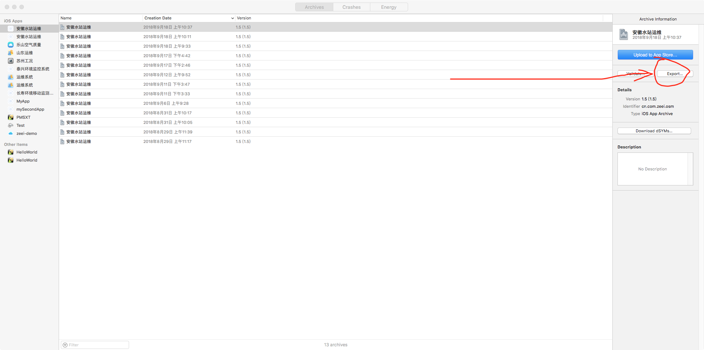
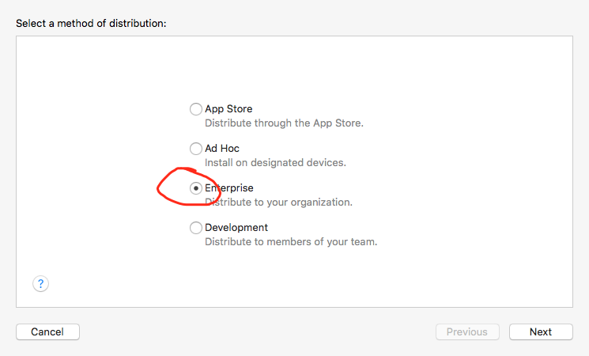
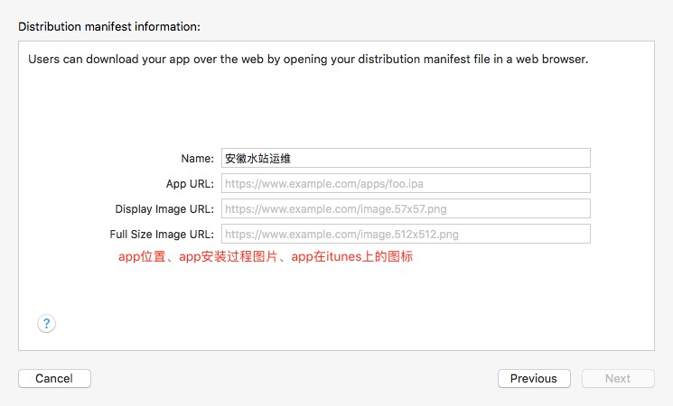

# manifest.plist 文件

#### 用于 ios 更新

- 点击`Export`导出 ipa 包  
  

- 选择`Enterprise`企业导包  
  
- 勾选`Additional Options`复选框  
  
- 填写三个 URL 地址  
   

  `manifest.plist`

  ````js
  <?xml version="1.0" encoding="UTF-8"?>

  <!DOCTYPE plist PUBLIC "-//Apple//DTD PLIST 1.0//EN" "http://www.apple.com/DTDs/PropertyList-1.0.dtd">
  <plist version="1.0">
  <dict>
  	<key>items</key>
  	<array>
  		<dict>
  			<key>assets</key>
  			<array>
  				<dict>
  					<key>kind</key>
  					<string>software-package</string>
  					<key>url</key>
  					<string>https://apple.augcat.com/osm/osm.ipa</string>
  				</dict>
  				<dict>
  					<key>kind</key>
  					<string>display-image</string>
  					<key>url</key>
  					<string>https://apple.augcat.com/57.png</string>
  				</dict>
  				<dict>
  					<key>kind</key>
  					<string>full-size-image</string>
  					<key>url</key>
  					<string>https://apple.augcat.com/512.png</string>
  				</dict>
  			</array>
  			<key>metadata</key>
  			<dict>
  				<key>bundle-identifier</key>
  				<string>cn.com.zeei.osm</string>
  				<key>bundle-version</key>
  				<string>1.5</string>
  				<key>kind</key>
  				<string>software</string>
  				<key>title</key>
  				<string>安徽水站运维</string>
  			</dict>
  		</dict>
  	</array>
  </dict>
  </plist>
     ```
  ````
