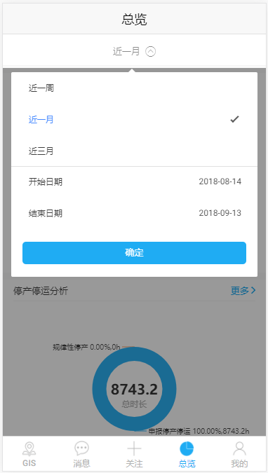

## searchFilter 下拉



## 可配置参数

|          参数          |     说明     |  类型   | 是否必须 | 可选值 | 默认值 |
| :--------------------: | :----------: | :-----: | :------: | :----: | :----: |
| **`searchButtonData`** |  初始选中值  | `Array` |   `Y`    |  `--`  |  `--`  |
| **`searchFilterData`** | 可供选择内容 | `Array` |   `Y`    |  `--`  |  `--`  |

#### searchButtonData

|      参数      |              说明              |   类型    | 是否必须 | 可选值 | 默认值 |
| :------------: | :----------------------------: | :-------: | :------: | :----: | :----: |
|   **`icon`**   |              图标              | `String`  |   `Y`    |  `--`  |  `--`  |
|   **`text`**   |              文本              | `String`  |   `Y`    |  `--`  |  `--`  |
|   **`type`**   | 类型(类型不同，则生成多个下拉) | `String`  |   `Y`    |  `--`  |  `--`  |
| **`showDate`** |       是否显示时间选择框       | `Boolean` |   `Y`    |  `--`  |  `--`  |
|   **`show`**   |            是否显示            | `Boolean` |   `Y`    |  `--`  |  `--`  |

#### searchFilterData

|      参数      |   说明   |   类型    | 是否必须 | 可选值 | 默认值 |
| :------------: | :------: | :-------: | :------: | :----: | :----: |
|  **`value`**   |    值    | `String`  |   `Y`    |  `--`  |  `--`  |
|   **`text`**   |   文本   | `String`  |   `Y`    |  `--`  |  `--`  |
|   **`type`**   |   类型   | `String`  |   `Y`    |  `--`  |  `--`  |
| **`showText`** | 显示文本 | `String`  |   `Y`    |  `--`  |  `--`  |
|   **`show`**   | 是否显示 | `Boolean` |   `Y`    |  `--`  |  `--`  |

## Methods

|      方法名       |   说明   | 参数 |
| :---------------: | :------: | :--: |
| **`ionSelected`** | 选中事件 | `--` |

## 组件调用

`search.ts`

```js
import { Component } from '@angular/core';
import { IonicPage, NavController, NavParams } from 'ionic-angular';


@IonicPage()
@Component({
  selector: 'page-search',
  templateUrl: 'search.html',
})
export class searchPage {
this.selectBar=[{
        icon: 'arrow-dropdown',
        text: '近一月',
        type: '0',
        showDate: true,
        show: true
      },{
        icon: 'arrow-dropdown',
        text: '近三月',
        type: '1',
        showDate: true,
        show: true
      }];
    this.searchFilterData=[
      {
        text: '近一周',
        type: '0',
        value: '0',
        showText: '近一周',
        checked: false
      }, {
        text: '近一月',
        type: '0',
        value: '1',
        showText: '近一月',
        checked: true
      }, {
        text: '近三月',
        type: '1',
        value: '2',
        showText: '近三月',
        checked: false
      }
    ];
  constructor(public navCtrl: NavController, public navParams: NavParams) {
    searchFilterData(val){

    }
  }
}
```

`search.html`

```js
<search-filter (ionSelected)='searchChange($event)' [searchButtonData]='selectBar' [searchFilterData]='searchFilterData'></search-filter>
```
