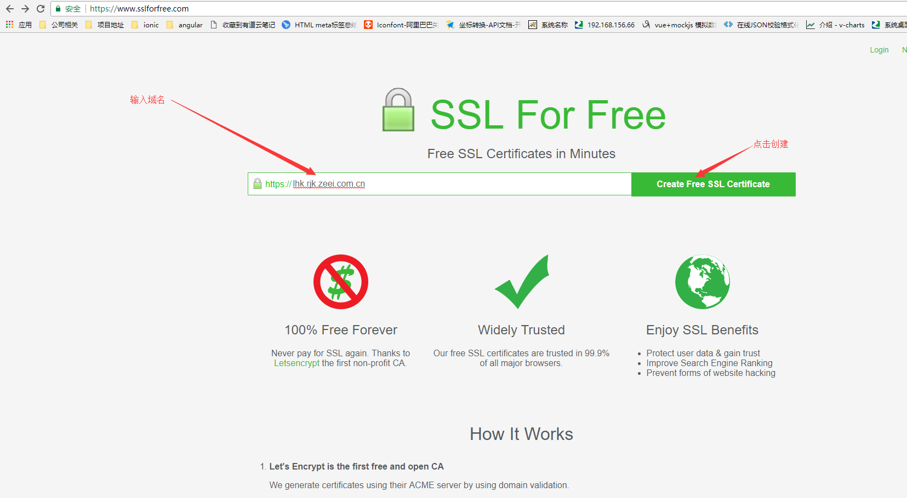
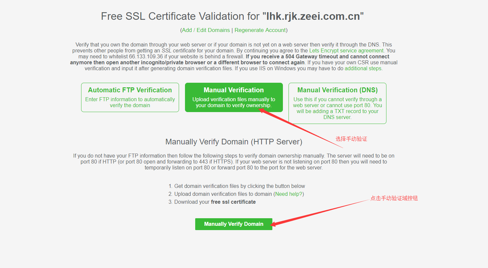
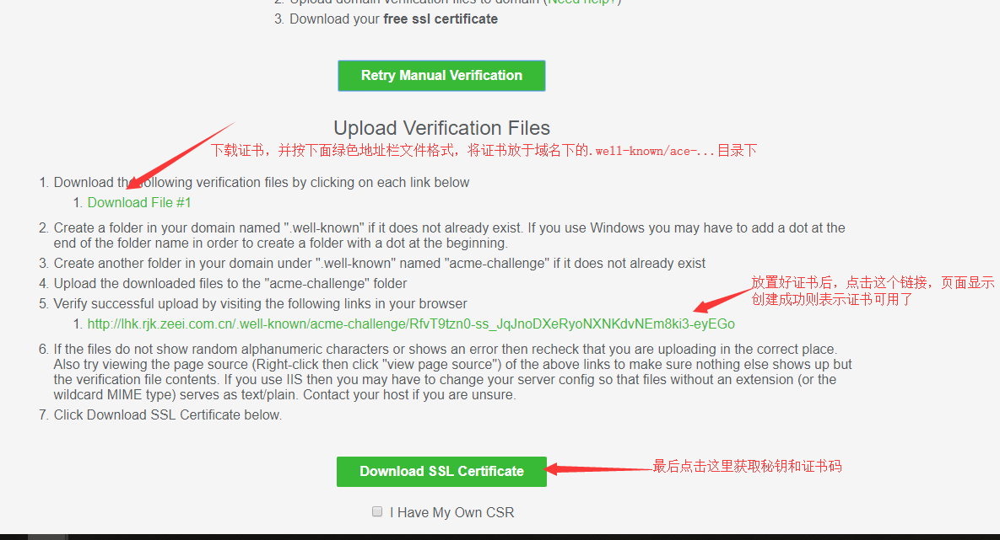
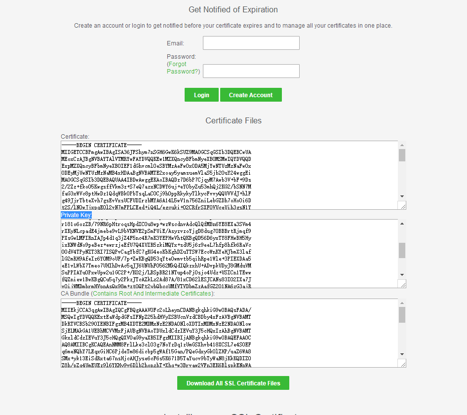

# 免费证书申请  
### https://www.sslforfree.com/
```
有效期90天，申请需要有域名
```  
- 填写有效域名，点击创建证书  
   
  

- 选择手动验证，点击手动验证域按钮  

  

- 下载证书，将证书添加到指定目录下，然后点击进行验证，验证通过后点击生成秘钥和证书  



- 生成3个文件代码，秘钥、证书、CA包,将其复制到域名管理中心进行配置，可将证书下载下来，下载下来的压缩包里面包含该三个文件  


