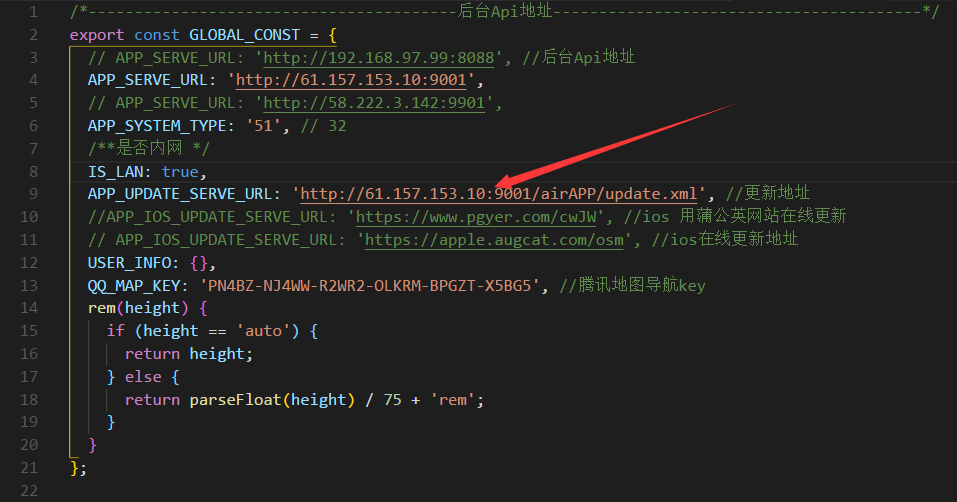
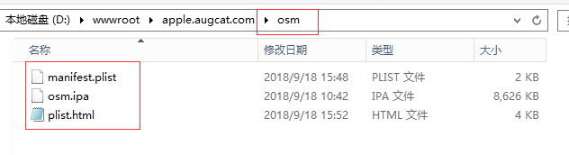
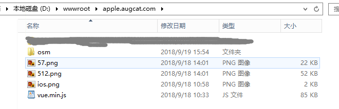

## 安装包发布配置

#### 将安卓、ios 包放于公司服务器，通过二维码扫描、分享链接等方式访问，下载安装 app。

- 开发人员配置 constants.ts

  

- APP_UPDATE_SERVE_URL:更新地址，需要有 update.xml 文件

`update.xml`

```js
<update>
  <version>1.0.0</version>
  <name>zeei-demo</name>
  <url>http://192.168.97.112:8090/app.apk</url>
  <ios_url>https://apple.augcat.com/osm</ios_url>
</update>
```

!> version 版本号、name 项目名、url 安卓 app 包地址、ios_url ios 地址，这 4 个为必须

- APP_IOS_UPDATE_SERVE_URL:ios 更新配置文件放置地址，其中包含 manifest.plist(生成方法、内容底部有)、plist.html、xxx.ipa  
  

!> osm 目录为对应项目的文件夹，每个项目对应一个文件夹，在上一级目录中，还需包含部分文件

  
ios.png、vue.min.js 为 plist.html 所需，57.png、512.png 为 manifest.plist 所需

- manifest.plist 可以在打包的时候生成，生成方式参考[manifest 生成](app/manifest.md)文档。也可以在其他项目中拷贝、修改。
  `manifest.plist`


