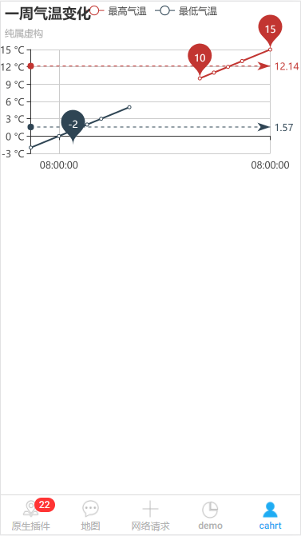

## zChart 图表

echart 图表



## 可配置参数

|     参数     |   说明   |      类型       | 是否必须 | 可选值 | 默认值 |
| :----------: | :------: | :-------------: | :------: | :----: | :----: |
| **`config`** | 配置信息 |    `Object`     |   `Y`    |  `--`  |  `--`  |
| **`height`** |   高度   | `Number,String` |   `N`    |  `--`  | `600`  |

## Methods

|    方法名     |       说明       | 参数 |
| :-----------: | :--------------: | :--: |
| **`refresh`** | 用于刷新图表数据 | `--` |

!>config 可参考[echarts](http://echarts.baidu.com/option.html#title)配置

!> 因组件渲染问题，宽度设置为 10vw,即手机屏幕宽度，在使用时，父级存在 padding 或 margin，将可能引发横向滚动条.

## 组件调用

`chart.ts`

```js
import { Component } from '@angular/core';
import { IonicPage, NavController, NavParams } from 'ionic-angular';


@IonicPage()
@Component({
  selector: 'page-chart',
  templateUrl: 'chart.html',
})
export class chartPage {
  config:Object;
  constructor(public navCtrl: NavController, public navParams: NavParams) {
      this.config = {
        title: {
          text: '一周气温变化',
          subtext: '纯属虚构'
        },
        tooltip: {
          trigger: 'axis'
        },
        legend: {
          data: ['最高气温', '最低气温']
        },
        xAxis: [
          {
            type: 'time',
            data: ['周一', '周二', '周三', '周四', '周五', '周六', '周日']
          }
        ],
        yAxis: [
          {
            type: 'value',
            axisLabel: {
              formatter: '{value} °C'
            }
          }
        ],
        series: [
          {
            name: '最高气温',
            type: 'line',
            data: [11, 11, 15, 13, 12, 13, 10],
            markPoint: {
              data: [
                { type: 'max', name: '最大值' },
                { type: 'min', name: '最小值' }
              ]
            },
            markLine: {
              data: [{ type: 'average', name: '平均值' }]
            }
          },
          {
            name: '最低气温',
            type: 'line',
            data: [1, -2, 2, 5, 3, 2, 0],
            markPoint: {
              data: [{ name: '周最低', value: -2, xAxis: 1, yAxis: -1.5 }]
            },
            markLine: {
              data: [{ type: 'average', name: '平均值' }]
            }
          }
        ]
      };
  }
}
```

`chart.html`

```js
<z-chart [config]='config' height='500'></z-chart>
```
