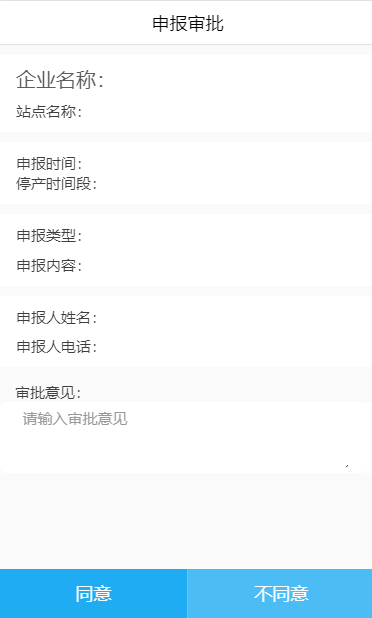

## zDeclare 异常申报

异常申报审批页面



## 可配置参数

|     参数      |   说明   |   类型   | 是否必须 | 可选值 |             默认值              |
| :-----------: | :------: | :------: | :------: | :----: | :-----------------------------: |
| **`rowData`** |   数据   | `Object` |   `Y`    |  `--`  |              `--`               |
|  **`type`**   |   类型   | `String` |   `N`    |  `--`  |             `post`              |
| **`btnUrl`**  | 审批接口 | `String` |   `N`    |  `--`  | `/pms/productiondeclare/update` |

#### rowData

|         参数         |     说明     |   类型   | 是否必须 | 可选值 | 默认值 |
| :------------------: | :----------: | :------: | :------: | :----: | :----: |
|     **`appId`**      |     编号     | `String` |   `Y`    |  `--`  |  `--`  |
|   **`enterName`**    |   企业名称   | `String` |   `Y`    |  `--`  |  `--`  |
|   **`pointName`**    |   站点名称   | `String` |   `Y`    |  `--`  |  `--`  |
|   **`applyDate`**    |   申报时间   | `String` |   `Y`    |  `--`  |  `--`  |
|   **`startDate`**    | 停产开始时间 | `String` |   `N`    |  `--`  |  `--`  |
|    **`endDate`**     | 停产结束时间 | `String` |   `N`    |  `--`  |  `--`  |
| **`applyTypeName`**  |   申报类型   | `String` |   `N`    |  `--`  |  `--`  |
|  **`applyContent`**  |   申报内容   | `String` |   `Y`    |  `--`  |  `--`  |
|   **`applyUser`**    |  申报人姓名  | `String` |   `N`    |  `--`  |  `--`  |
| **`applyUserPhone`** |  申报人电话  | `String` |   `N`    |  `--`  |  `--`  |
|  **`auditResult`**   |   审批意见   | `String` |   `N`    |  `--`  |  `--`  |

## 组件调用

`mine.ts`

```js
import { Component } from '@angular/core';
import { IonicPage, NavController, NavParams } from 'ionic-angular';


@IonicPage()
@Component({
  selector: 'page-mine',
  templateUrl: 'mine.html',
})
export class minePage {
  rowData:Object;
  constructor(public navCtrl: NavController, public navParams: NavParams) {
    this.rowData={
      appId:'123',
      enterName: '企业',
      pointName: '站点1',
      applyDate: '2018-09-01',
      startDate: '',
      endDate: '',
      applyTypeName: '',
      applyContent: '',
      applyUser: '',
      applyUserPhone: '',
      auditResult: ''
    }
  }
}
```

`mine.html`

```js
<z-declare [rowData]='rowData'></z-declare>
```
