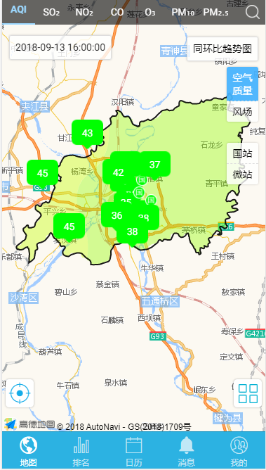

## zDistribution 溶度图层

地图溶度图层



## 可配置参数

|         参数          |     说明     |   类型    | 是否必须 | 可选值 | 默认值 |
| :-------------------: | :----------: | :-------: | :------: | :----: | :----: |
|     **`visible`**     | 是否显示图层 | `Boolean` |   `N`    |  `--`  | `true` |
| **`httpDataOptions`** |  http 请求   | `Object`  |   `Y`    |  `--`  |  `--`  |

#### httpDataOptions

|     参数     | 说明 |   类型   | 是否必须 | 可选值 | 默认值 |
| :----------: | :--: | :------: | :------: | :----: | :----: |
|  **`url`**   | 接口 | `String` |   `Y`    |  `--`  |  `--`  |
|  **`type`**  | 类型 | `String` |   `Y`    |  `--`  |  `--`  |
| **`params`** | 参数 | `Object` |   `N`    |  `--`  |  `--`  |

## 组件调用

!>组件使用前提是已使用 z-gis 组件

`distribution.ts`

```js
import { Component } from '@angular/core';
import { IonicPage, NavController, NavParams } from 'ionic-angular';


@IonicPage()
@Component({
  selector: 'page-distribution',
  templateUrl: 'distribution.html',
})
export class distributionPage {
  visible = true;
  postParam = {
    url: 'xxxxxxxxxxxxxxxxxxxxx',
    type: 'post',
    params: {
      systemType: 32
    }
  };
  constructor(public navCtrl: NavController, public navParams: NavParams) {

  }
}
```

`distribution.html`

```js
<z-gis>
  <z-distribution [httpDataOptions]='postParam'></z-distribution>
</z-gis>
```
