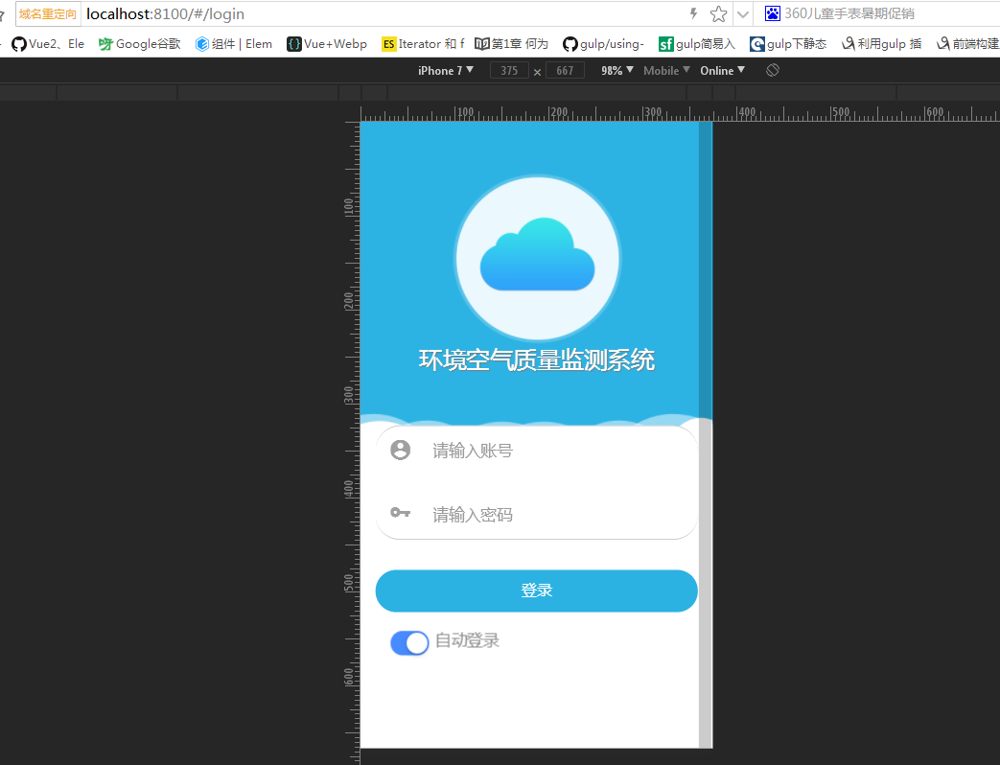

## zLogin 登录

登录组件页。



## 可配置参数

|        参数         |   说明    |   类型   | 是否必须 | 可选值 |                 默认值                 |
| :-----------------: | :-------: | :------: | :------: | :----: | :------------------------------------: |
|     **`title`**     | 系统名称  | `String` |   `Y`    |  `--`  |             `在线监测系统`             |
|   **`logoPath`**    | 系统 logo | `String` |   `N`    |  `--`  | `assets/product/images/login/logo.png` |
| **`backgroundImg`** |  背景图   | `String` |   `N`    |  `--`  |  `assets/product/images/login/bg.png`  |

## 组件调用

`login.ts`

```js
import { Component } from '@angular/core';
import { IonicPage, NavController, NavParams } from 'ionic-angular';


@IonicPage()
@Component({
  selector: 'page-login',
  templateUrl: 'login.html',
})
export class LoginPage {
  title:string="系统名称"
  backgroundImg:string='assets/product/images/bg.png'
  logoPath:string='assets/product/images/logo.png'
  constructor(public navCtrl: NavController, public navParams: NavParams) {
  }
}
```

`login.html`

```js
<z-login [title]='title' [backgroundImg]='backgroundImg' [logoPath]='logoPath'></z-login>
```
