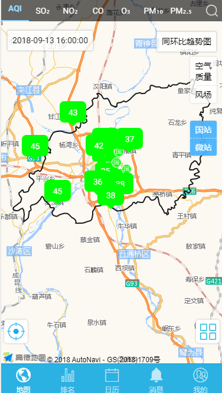

## zMarker 标记

地图 marker 标记点



## 可配置参数

|         参数          |      说明      |   类型    | 是否必须 | 可选值 |                默认值                 |
| :-------------------: | :------------: | :-------: | :------: | :----: | :-----------------------------------: |
|     **`visible`**     |  是否显示图层  | `Boolean` |   `N`    |  `--`  |                `true`                 |
|     **`imgUrl`**      | 标记点图标路径 | `String`  |   `N`    |  `--`  | `assets/product/images/marker/marker` |
| **`httpDataOptions`** |   http 请求    | `Object`  |   `Y`    |  `--`  |                 `--`                  |
|   **`systemType`**    |    系统类型    | `String`  |   `N`    |  `--`  |                 `--`                  |

#### httpDataOptions

|     参数     | 说明 |   类型   | 是否必须 | 可选值 | 默认值 |
| :----------: | :--: | :------: | :------: | :----: | :----: |
|  **`url`**   | 接口 | `String` |   `Y`    |  `--`  |  `--`  |
|  **`type`**  | 类型 | `String` |   `Y`    |  `--`  |  `--`  |
| **`params`** | 参数 | `Object` |   `N`    |  `--`  |  `--`  |

## Methods

|      方法名       |      说明      | 参数 |
| :---------------: | :------------: | :--: |
| **`markerClick`** | 标记点点击回调 | `--` |

## 组件调用

!>组件使用前提是已使用 z-gis 组件

`marker.ts`

```js
import { Component } from '@angular/core';
import { IonicPage, NavController, NavParams } from 'ionic-angular';


@IonicPage()
@Component({
  selector: 'page-marker',
  templateUrl: 'marker.html',
})
export class markerPage {
  systemType = 32;
  visible = true;
  postParam = {
    url: 'xxxxxxxxxxxxxxxxxxxxxxxxxxxxxxx',
    type: 'post',
    params: {
      systemType: 32
    }
  };
  constructor(public navCtrl: NavController, public navParams: NavParams) {
    markerClick(evl) {

    }
  }
}
```

`marker.html`

```js
    <z-gis>
      <z-marker [httpDataOptions]='postParam' (markerClick)='markerClick($event)'></z-marker>
    </z-gis>
```
