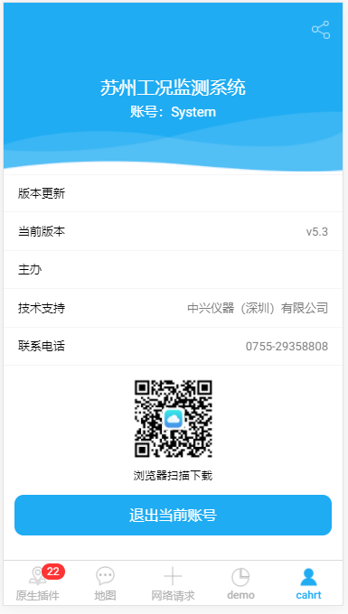

## zMine 我的

我的页面



## 可配置参数

|        参数         |   说明   |   类型   | 是否必须 | 可选值 |           默认值           |
| :-----------------: | :------: | :------: | :------: | :----: | :------------------------: |
|  **`tecSupport`**   | 技术支持 | `String` |   `N`    |  `--`  | `中兴仪器（深圳）有限公司` |
| **`contactNumber`** | 联系电话 | `String` |   `Y`    |  `--`  |      `0755-29358808`       |
|     **`host`**      |   主办   | `String` |   `N`    |  `--`  |            `--`            |

## 组件调用

`mine.ts`

```js
import { Component } from '@angular/core';
import { IonicPage, NavController, NavParams } from 'ionic-angular';


@IonicPage()
@Component({
  selector: 'page-mine',
  templateUrl: 'mine.html',
})
export class minePage {
  constructor(public navCtrl: NavController, public navParams: NavParams) {

  }
}
```

`mine.html`

```js
<z-mine title="监测系统" version="2.0" />
```
