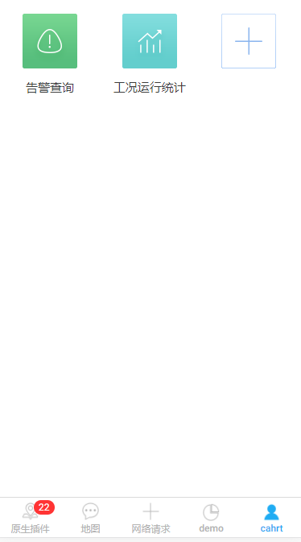

## zNineGrid 九宫格

九宫格设置快捷导航。



## 可配置参数

|      参数      |   说明   |   类型    | 是否必须 | 可选值 | 默认值  |
| :------------: | :------: | :-------: | :------: | :----: | :-----: |
|  **`isView`**  | 是否查看 | `Boolean` |   `N`    |  `--`  | `false` |
| **`gridData`** |   数据   |  `Array`  |   `Y`    |  `--`  |  `--`   |

#### gridData

|     参数      |   说明   |   类型    | 是否必须 | 可选值 | 默认值 |
| :-----------: | :------: | :-------: | :------: | :----: | :----: |
|  **`text`**   |   文本   | `String`  |   `Y`    |  `--`  |  `--`  |
|  **`icon`**   |   图标   | `String`  |   `Y`    |  `--`  |  `--`  |
|   **`url`**   |   路由   | `String`  |   `Y`    |  `--`  |  `--`  |
| **`checked`** | 是否选中 | `Boolean` |   `Y`    |  `--`  |  `--`  |

## 组件调用

`nine.ts`

```js
import { Component } from '@angular/core';
import { IonicPage, NavController, NavParams } from 'ionic-angular';


@IonicPage()
@Component({
  selector: 'page-nine',
  templateUrl: 'nine.html',
})
export class ninePage {
  isView:Boolean=true;
  gridData:Object[];
  constructor(public navCtrl: NavController, public navParams: NavParams) {
    this.gridData=[
      {
        text: '告警查询',
        icon: 'assets/product/images/quick/quick1.png',
        url: 'SearchPage',
        checked: true
      }
    ]
  }
}
```

`nine.html`

```js
<z-nine-grid [gridData]='gridData' [isView]='isView'></z-nine-grid>
```
