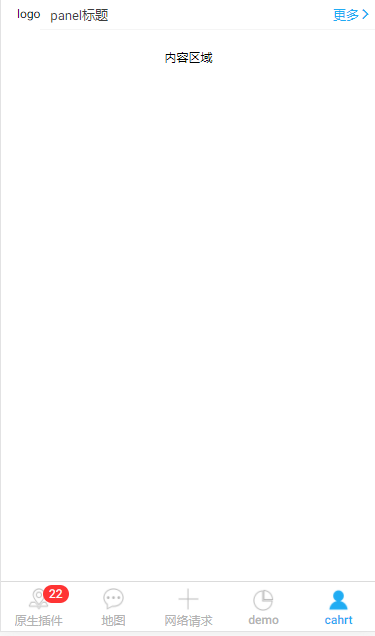

## zPanel 面板

面板,用于展示内容.



## 可配置参数

|    参数     |    说明    |   类型   | 是否必须 | 可选值 | 默认值 |
| :---------: | :--------: | :------: | :------: | :----: | :----: |
| **`title`** | panel 标题 | `String` |   `N`    |  `--`  |  `--`  |

## 组件调用

!>panel-icon、panel-handle 采用分发机制，定义 name 属性值，分别显示在 panel 标题左右区域

`panel.ts`

```js
import { Component } from '@angular/core';
import { IonicPage } from 'ionic-angular';
@IonicPage()
@Component({
  templateUrl: 'panel.html'
})
export class panelPage {
  constructor() {}
}
```

`panel.html`

```js
<z-panel title="panel标题">
  <div name="panel-icon">logo</div>
  <div name="panel-handle">
    更多
    <ion-icon name="ios-arrow-forward" />
  </div>
  <div>这里放置panel面板显示内容</div>
</z-panel>
```
