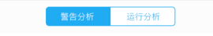

## zSegment 分隔

按钮进行内容显隐切换。



## 可配置参数

|    参数    |   说明   |  类型   | 是否必须 | 可选值 | 默认值 |
| :--------: | :------: | :-----: | :------: | :----: | :----: |
| **`data`** | 显示数据 | `Array` |   `Y`    |  `--`  |  `--`  |

#### data

|    参数     |   说明   |      类型       | 是否必须 | 可选值 | 默认值 |
| :---------: | :------: | :-------------: | :------: | :----: | :----: |
| **`label`** | 显示文本 |    `String`     |   `Y`    |  `-`   |  `--`  |
| **`value`** |    值    |    `String`     |   `Y`    |  `--`  |  `--`  |
| **`badge`** |   角标   | `Stirng,Number` |   `N`    |  `-`   |  `--`  |

## Methods

|     方法名      |      说明      | 参数 |
| :-------------: | :------------: | :--: |
| **`segChange`** | 标记点点击回调 | `--` |

## 组件调用

`segment.ts`

```js
import { Component } from '@angular/core';
import { IonicPage } from 'ionic-angular';
@IonicPage()
@Component({
  templateUrl: 'segment.html'
})
export class segmentPage {
  data: Object[];
  constructor() {
    this.data = [
      {
        label: '实时数据',
        value: '0',
        badge: '',
      },
      {
        label: '历史数据',
        value: '1',
        badge: 11,
      }
    ];

    segChange(event){

    }
  }
}
```

`segment.html`

```js
<z-segment (segChange)="segChange($event)" [data]="data"></z-segment>
```
