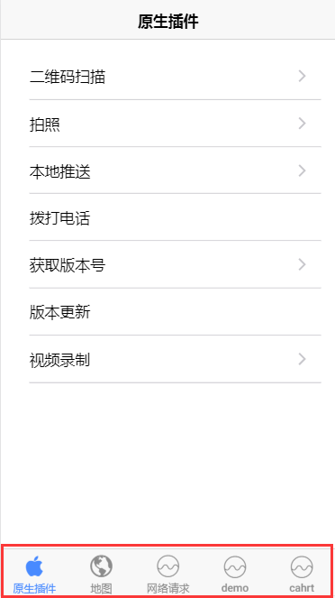

## zTabs 底部导航

手机底部导航菜单栏。



## 可配置参数

|       参数        |             说明             |   类型    | 是否必须 | 可选值 | 默认值  |
| :---------------: | :--------------------------: | :-------: | :------: | :----: | :-----: |
|  **`tabRoots`**   |      显示的底部菜单数据      | `Object`  |   `Y`    |  `--`  |  `--`   |
| **`isCustomize`** | 显示的底部菜单图标是否自定义 | `Boolean` |   `N`    |  `--`  | `false` |

#### tabRoots

|      参数      |         说明         |      类型       | 是否必须 | 可选值 | 默认值 |
| :------------: | :------------------: | :-------------: | :------: | :----: | :----: |
|   **`root`**   | 导航到对应的页面地址 | `String,Object` |   `Y`    |  `-`   |  `--`  |
| **`tabTitle`** |       导航名称       |    `String`     |   `Y`    |  `--`  |  `--`  |
| **`tabIcon`**  |       导航图标       |    `Stirng`     |   `Y`    |  `-`   |  `--`  |
| **`TabBadge`** |       导航角标       | `Number,String` |   `N`    |  `--`  |  `--`  |

!>isCustomize 为 false 则表示使用 ionicons 图标。为 true 则使用自定义图标，默认图标名称 tab1.png tab1_active.png 以此内推，若改变命名，需要前往 app.scss 中更改！

## 组件调用

`tabs.ts`

```js
import { Component } from '@angular/core';
import { IonicPage } from 'ionic-angular';
@IonicPage()
@Component({
  templateUrl: 'tabs.html'
})
export class TabsPage {
  tabRoots: Object[];
  isCustomize: Boolean = false;
  constructor() {
    this.tabRoots = [
      {
        root: 'NativePage',
        tabTitle: '原生插件',
        tabIcon: 'logo-apple',
        tabBadge: 22
      },
      {
        root: 'GisPage',
        tabTitle: '地图',
        tabIcon: 'md-globe',
        tabBadge: ''
      },
      {
        root: 'AjaxPage',
        tabTitle: '网络请求',
        tabIcon: 'analytics',
        tabBadge: ''
      },
      {
        root: 'ProviderTestPage',
        tabTitle: 'demo',
        tabIcon: 'analytics',
        tabBadge: ''
      },
      {
        root: 'ChartPage',
        tabTitle: 'cahrt',
        tabIcon: 'analytics',
        tabBadge: ''
      }
    ];
  }
}
```

`tabs.html`

```js
<z-tabs [tabRoots]="tabRoots" [isCustomize]="isCustomize"></z-tabs>
```
