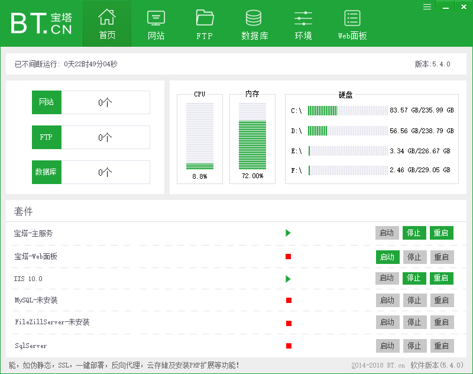
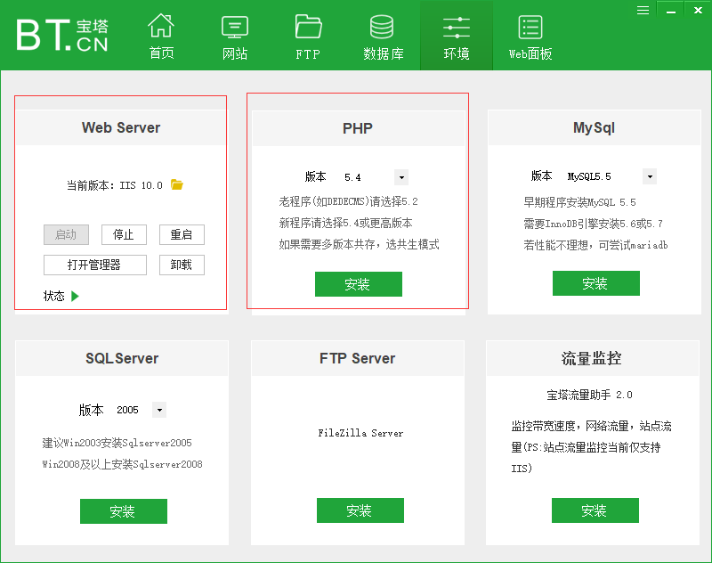
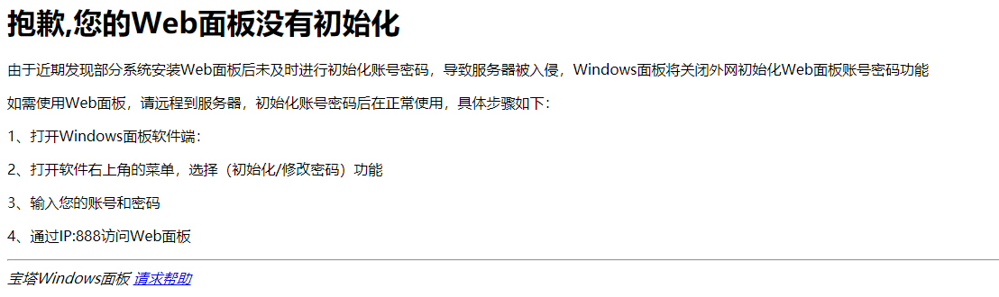
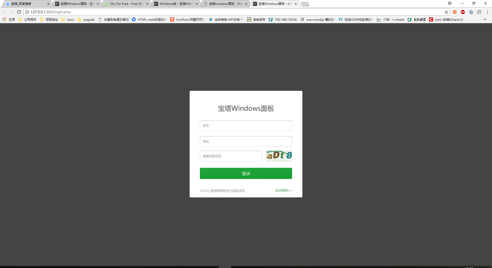
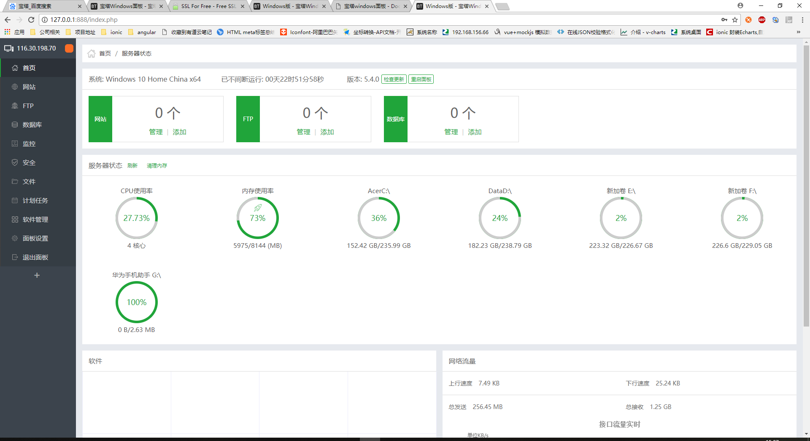
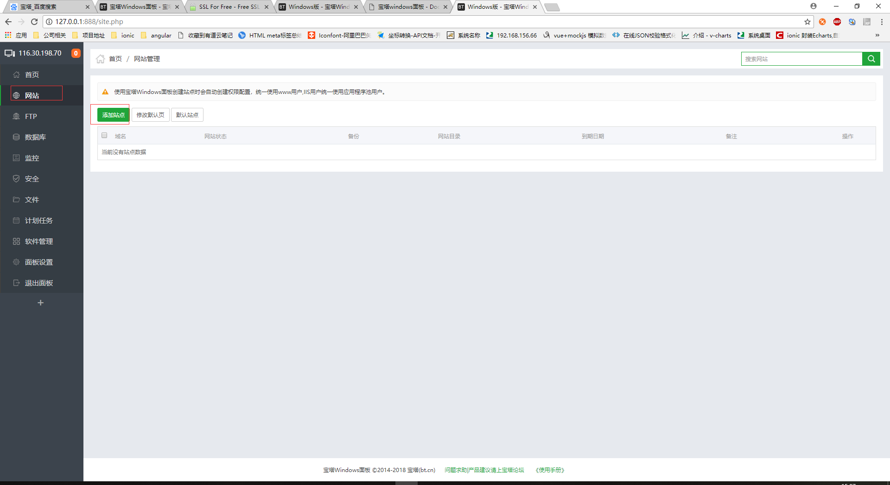
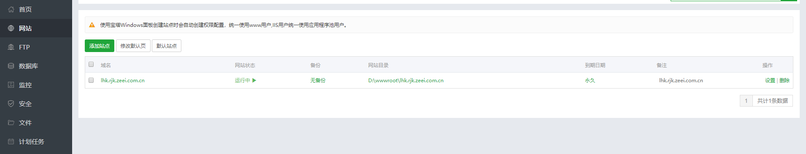
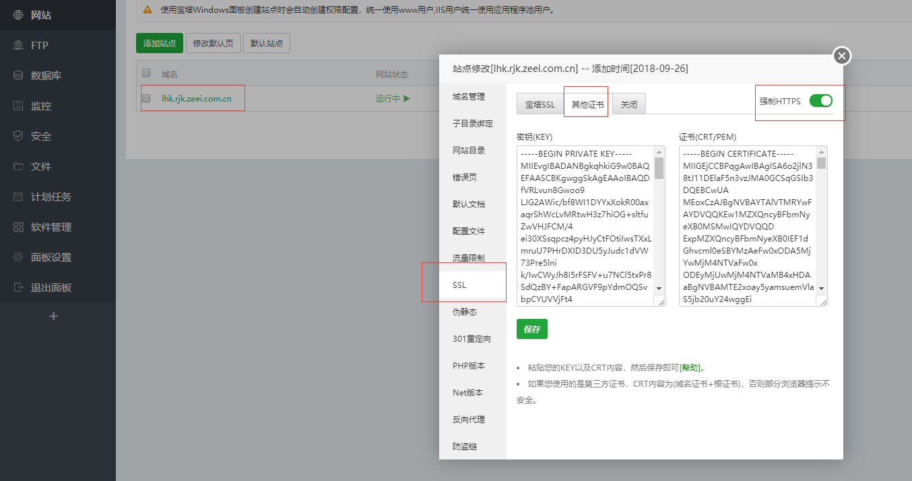
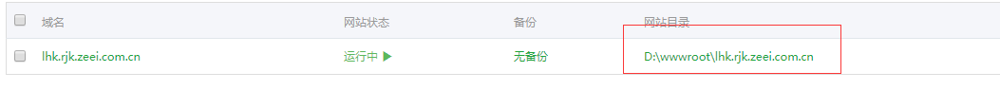
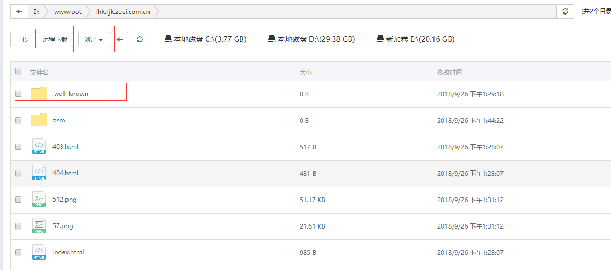

# 宝塔 windows 面板

### https://www.bt.cn/download/windows.html

```
一键管理服务器，节省85%的运维时间
```

- 安装软件，运行



- 点击环境，安装所需环境



- 点击 web 面板，会打开浏览器进入 web 端管理界面

!> `第一次使用会提示如下错误`



- 配置好后重新进入，登录



- 主界面



- 添加站点(网站)



- 输入域名 选择类型为 PHP 的话，如果没有安装 PHP 环境，PHP 版本处无法选择


- 网站创建完成



- 点击域名栏，进入网站配置栏，配置 SSL

!> 启动 https 的话，需要填写完证书和秘钥好，保存，再开启`强制HTTPS`，开启完成后最好重启浏览器后尝试是否成功



- 点击`网站目录`进入目录



- 网站目录里面 `.well-known`文件夹为证书所放位置，其余文件为个人网站所需，可通过上面的上传按钮进行上传，或者直接到文件夹内进行拷贝，创建按钮可创建文件夹和文件


