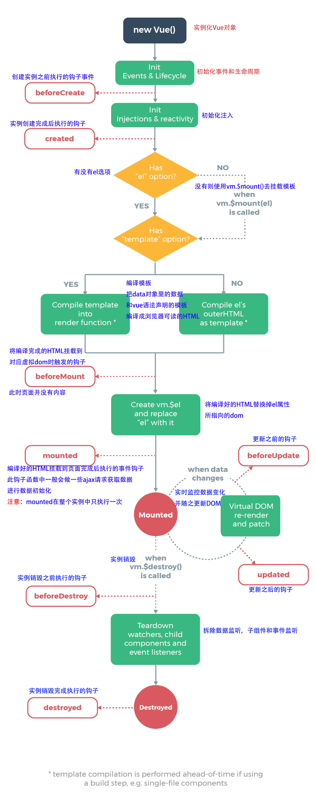

# 知识点
## vue生命周期
> beforeCreate、created、beforeMount、mounted、beforeUpdate、updated、beforeDestroy、destroyed

- `beforeCreate` : vue中的data和method都无

- `created` : data和method都初始化完，可以使用。 `注意：`此时还没有el选项，挂载阶段还没开始

- `beforeMounte` : 完成了初始化，给vue实例对象添加$el成员，此时代码中的绑定还未替换
< h1>\{\{message\}/}< /h1>  message还未替换

- `mounted` : 完成挂载  < h1>vue挂载< /h1>


- `beforeUpdate和updated` : 当vue发现data中的数据发生了改变，会触发对应组件的重新渲染，先后调用beforeUpdate和updated钩子函数

- `beforeDestroy` : 钩子函数在实例销毁之前调用。在这一步，实例仍然完全可用

- `destroyed` : 钩子函数在Vue 实例销毁后调用。调用后，Vue 实例指示的所有东西都会解绑定，所有的事件监听器会被移除，所有的子实例也会被销毁


!> `因此，初始化部分写在created中，需要进行dom操作的，写在mounted中，`  
`比如：echarts初始化 echart = echarts.init(document.getElementById('id'))`

  

## npm install -save 和 -save-dev 区别
`npm install moduleName 命令`
1. 安装模块到项目node_modules目录下。
2. 不会将模块依赖写入devDependencies或dependencies 节点。
3. 运行 npm install 初始化项目时不会下载模块。

`npm install -g moduleName 命令`
1. 安装模块到全局，不会在项目node_modules目录中保存模块包。
2. 不会将模块依赖写入devDependencies或dependencies 节点。
3. 运行 npm install 初始化项目时不会下载模块。

`npm install -save moduleName 命令`
1. 安装模块到项目node_modules目录下。
2. 会将模块依赖写入dependencies 节点。
3. 运行 npm install 初始化项目时，会将模块下载到项目目录下。
4. 运行npm install --production或者注明NODE_ENV变量值为production时，会自动下载模块到node_modules目录中。

`npm install -save-dev moduleName 命令`
1. 安装模块到项目node_modules目录下。
2. 会将模块依赖写入devDependencies 节点。
3. 运行 npm install 初始化项目时，会将模块下载到项目目录下。
4. 运行npm install --production或者注明NODE_ENV变量值为production时，不会自动下载模块到node_modules目录中。

> __`总结`__  
devDependencies 节点下的模块是我们在开发时需要用的，比如项目中使用的 gulp ，压缩css、js的模块。这些模块在我们的项目部署后是不需要的，所以我们可以使用 -save-dev 的形式安装。像 express 这些模块是项目运行必备的，应该安装在 dependencies 节点下，所以我们应该使用 -save 的形式安装。  

## vue-router 路由传参  

```js
routes: [
  {
    path: '/home',
    name: 'home',
    component: ...
  }
]
```

<strong>声明式的导航：</strong> 
```js
<router-link to="news">click to news page</router-link>

<router-link :to="{ name: 'news', params: { userId: 1111}}">click to news page</router-link>
```

<strong>编程式导航:</strong>

1.无参路由跳转:

```js
this.$router.push('home');
```  

2.带参路由跳转:

* params传递参数(类似于post请求)  

!> `注意：命名路由这种方式传递的参数，如果在目标页面刷新会出错`  

```js
this.$router.push({ name: 'home', params: { userId: 123 }}) // 传递参数

this.$route.params.userId // 接受传递的参数
```  

* query传递参数(类似于get请求)

!> `必须配合path来传递参数而不能用name`  

```js
this.$router.push({ path: '/home', query: { userId: 123 }})  

this.$route.query.userId
```  

router.js中配置路由参数

```js
routes: [{
  // 流程审核
  path: '/process-approval/:id',
  name: 'process-approval',
  component: resolve => require(['../pages/work-flow/process-approval'], resolve)
}]

this.$router.push({
  path: `/process-approval/${this.row.deployId}`
});

this.$route.param.id
```