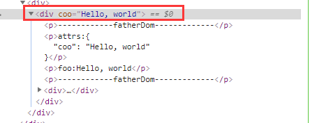
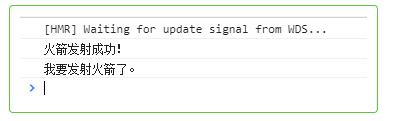

## inheritAttrs、attrs和listeners使用场景

   <strong>组件传值</strong>，尤其是<strong>祖孙组件</strong>有跨度的传值。

## inheritAttrs

  组件传值一般是通过<strong>props</strong>传值的。inheritAttrs默认值为true，true的意思是将父组件中除了props外的属性添加到子组件的<strong>根节点上(说明，即使设置为true，子组件仍然可以通过$attr获取到props意外的属性)</strong>

  示例： 

  `parent.vue`
  ```html
  <template>
    <div>
      <child-dom
      :foo="foo"
      :coo="coo"
      @upRocket="reciveRocket"
      ></child-dom>
    </div>
  </template>
  <script>
   import childDom from "./childDom.vue";
   export default {
     data() {
        return {
          foo:"Hello, world",
          coo:"Hello,rui"
        }
     },
     components:{childDom},
     methods:{
       reciveRocket(){
         window.console.log('火箭发射成功！')
       }
     }
   }
</script>

  ```

  `childDom.vue`

  ```html
    <template>
      <div>
        <p>attrs: {{$attrs}}</p>
        <p>foo: {{foo}}</p>
      </div>
      <three-dom v-bind="$attrs" v-on="$listeners"></three-dom>
    </template>
    <script>
    import threeDom from "./threeDom.vue";
    export default {
      name: 'child-dom',
      props: ['foo']
    }
    </script>
  ``` 

  

  接着设置 `childDom.vue` 的inheritAttrs:false，coo属性就不会显示在childDom根节点上了。但是怎么<strong>获取到coo呢？</strong>  

  这里就通过<strong>$attrs</strong>获取到coo。  
  
`threeDom.vue`  
```html  
<template>
  <div>
    <p>coo:{{coo}}</p>
    <button @click="startUpRocket">我要发射火箭</button>
  </div>
</template>
<script>
export default {
  name: "threeDom",
  props: ["coo"],
  methods: {
    startUpRocket() {
      this.$emit("upRocket");
      window.console.log('我要发射火箭了。')
    }
  }
};
</script>
```  

孙组件threeDom.vue就可以通过<strong>props</strong>接收到coo属性了。   

以上是父--子--孙向下传递值。

那怎么孙-子--父传递数据呢？

子组件使用<strong>$listeners</strong>传递，最终父组件接收到孙组件的事件了。  


