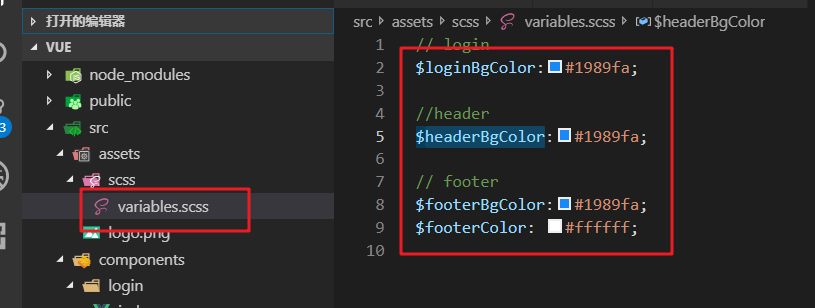
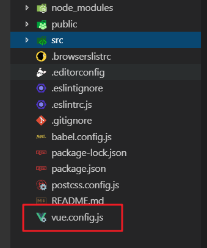
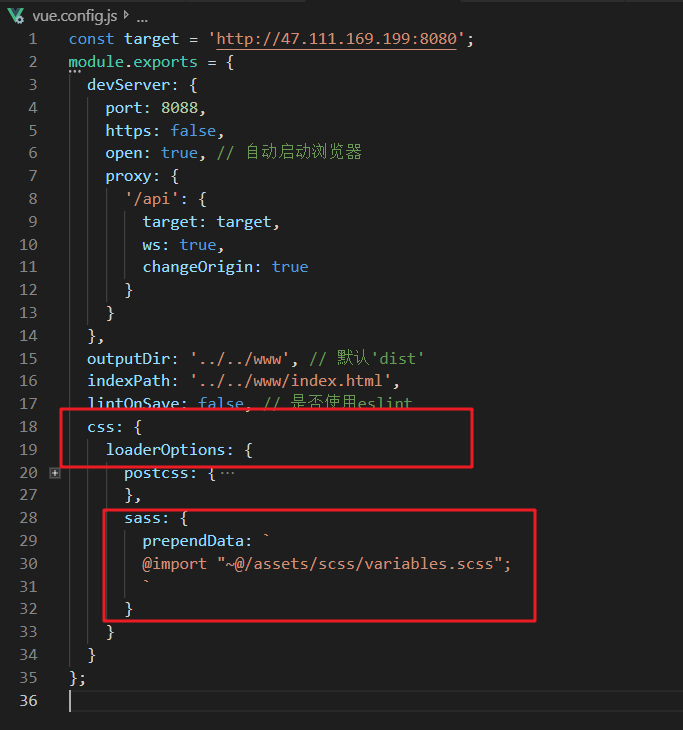
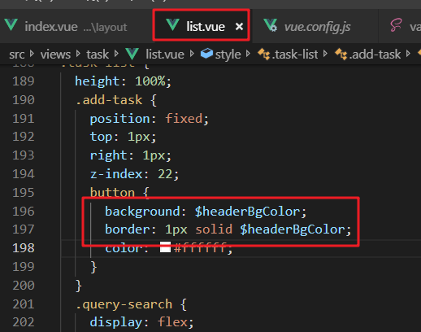

# sass全局
 
  定义一个sass文件，如`valiables.scss`，在vue-cli3.0中，引入后在各个组件中能直接使用.（前提需要安装node-sass等依赖）

  1. 在根目录创建vue.config.js文件
  2. css的loaderOptions中添加sass并引入文件
  3. 组件中直接使用

  !> `新旧版本sass-loader写法不同`

  ```js
  // 旧
  data: `@import "~@/assets/scss/variables.scss";`
  // 新
  prependData: `@import "~@/assets/scss/variables.scss";`
  ```

    

    

    

  