# 标题

- 第一种：
  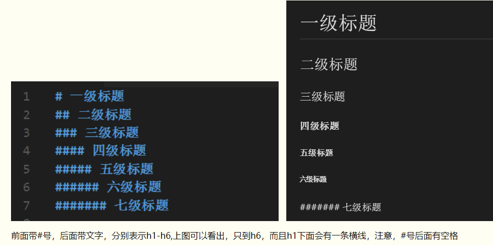

- 第二种：
  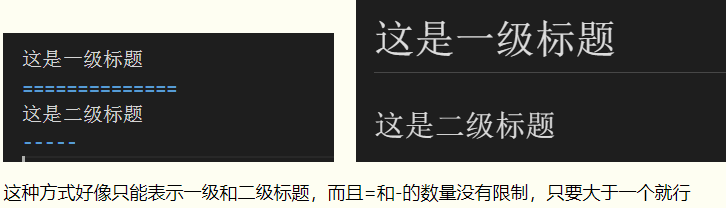

- 第三种：
  

# 列表

- 无序列表  
  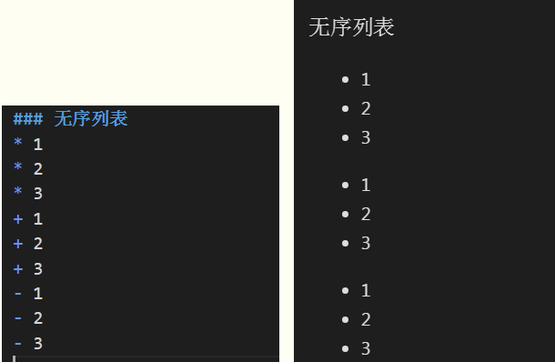

- 有序列表  
  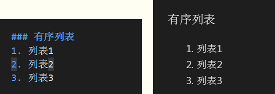

# 区块引用

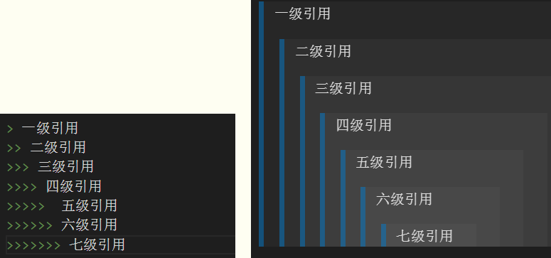

# 分割线

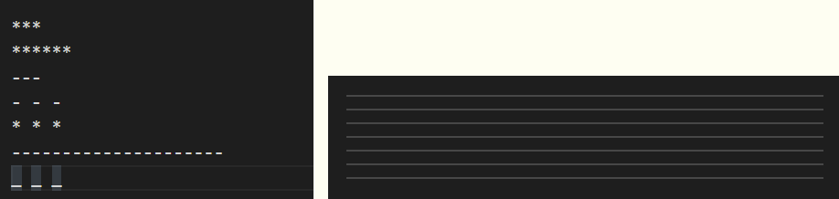

# 链接

链接带`title属性`，注意：链接地址后面空一格，然后引号引起来  

# 图片

# 代码框

`单行`
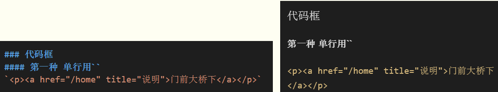
`多行`
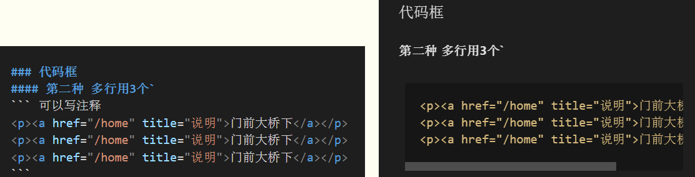

# 表格

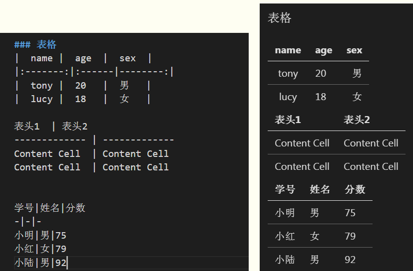

# 强调

# 转义

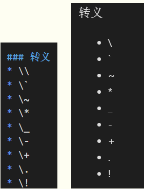

# 删除线

# 警告

`!> fadfadf`  
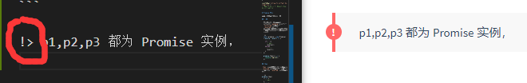
